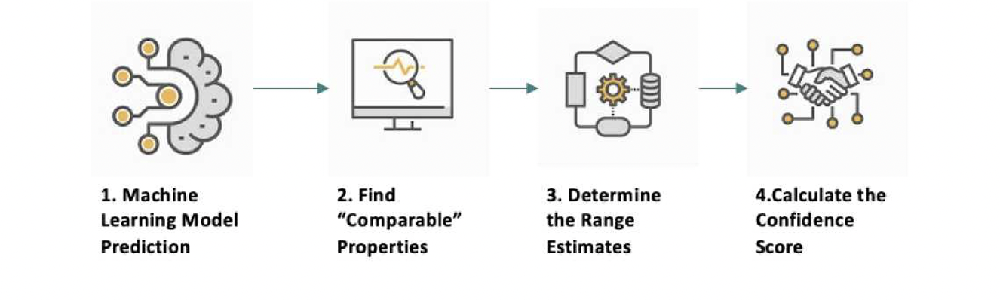

<p align="center">

</p>

[](https://badge.fury.io/py/bciavm)
[](https://pypistats.org/packages/bciavm)

The Blockchain & Climate Institute (BCI) is a progressive think tank providing leading expertise in the deployment of emerging technologies for climate and sustainability actions. 

As an international network of scientific and technological experts, BCI is at the forefront of innovative efforts, enabling technology transfers, to create a sustainable and clean global future.

# Automated Valuation Model (AVM) 

#### About
AVM is a term for a service that uses mathematical modeling combined with databases of existing properties and transactions to calculate real estate values. 
The majority of automated valuation models (AVMs) compare the values of similar properties at the same point in time. 
Many appraisers, and even Wall Street institutions, use this type of model to value residential properties. (see [What is an AVM](https://www.investopedia.com/terms/a/automated-valuation-model.asp) Investopedia.com)

For more detailed info about the AVM, please read the **About** paper in the [resources directory](https://github.com/gcode-ai/bciavm/blob/4e0816b25dae021629e406194a72d3d805faecf0/resources/2021-BCI-AVM-About.pdf).

### Valuation Process


**Key Functionality**

* **Supervised algorithms** 
* **Tree-based & deep learning algorithms** 
* **Feature engineering derived from small clusters of similar properties** 
* **Ensemble (value blending) approaches** 

## Set the required AWS Environment Variables
```shell
export ACCESS_KEY=YOURACCESS_KEY
export SECRET_KEY=YOURSECRET_KEY
export BUCKET_NAME=bci-transition-risk-data
export TABLE_DIRECTORY=/dbfs/FileStore/tables/
```

## Install [from PyPI](https://pypi.org/project/bciavm/)
```shell
pip install bciavm
```

## Start

#### Load the training data from the BCI S3 bucket
```python
from bciavm.core.config import your_bucket
from bciavm.utils.bci_utils import ReadParquetFile, get_postcodeOutcode_from_postcode, get_postcodeArea_from_outcode, drop_outliers, preprocess_data
import pandas as pd

dfPricesEpc = pd.DataFrame()
dfPrices = pd.DataFrame()

yearArray = ['2020', '2019']
for year in yearArray:
    singlePriceEpcFile = pd.DataFrame(ReadParquetFile(your_bucket, 'epc_price_data/byDate/2021-02-04/parquet/' + year))
    dfPricesEpc = dfPricesEpc.append(singlePriceEpcFile)

dfPricesEpc['POSTCODE_OUTCODE'] = dfPricesEpc['Postcode'].apply(get_postcodeOutcode_from_postcode)
dfPricesEpc['POSTCODE_AREA'] = dfPricesEpc['POSTCODE_OUTCODE'].apply(get_postcodeArea_from_outcode)
dfPricesEpc.groupby('TypeOfMatching_m').count()['Postcode']
```


#### Preprocess & split the data for training/testing
```python
import bciavm
X_train, X_test, y_train, y_test = bciavm.preprocess_data(dfPricesEpc)
```

#### Build the pipeline and get the default pipeline parameters
```python
from bciavm.pipelines import RegressionPipeline

class AVMPipeline(RegressionPipeline):
        custom_name = 'AVM Pipeline'
        component_graph = {
            "Preprocess Transformer": ["Preprocess Transformer"],
            'Imputer': ['Imputer', "Preprocess Transformer"],
            'One Hot Encoder': ['One Hot Encoder', "Imputer"],
            'K Nearest Neighbors Regressor': ['K Nearest Neighbors Regressor', 'One Hot Encoder'],
            "XGBoost Regressor": ["XGBoost Regressor", 'One Hot Encoder'],
            'MultiLayer Perceptron Regressor': ['MultiLayer Perceptron Regressor',  'One Hot Encoder'],
            'Final Estimator': ['Linear Regressor', "XGBoost Regressor", 'MultiLayer Perceptron Regressor', 'K Nearest Neighbors Regressor']
        }
    
avm_pipeline = AVMPipeline(parameters={})
avm_pipeline.parameters
```


#### Fit the pipeline
```python
avm_pipeline.fit(X_train, y_train)
```


#### Score the pipeline
```python
avm_pipeline.score(  X_test, 
                     y_test, 
                     objectives=['MAPE',
                               'MdAPE',
                               'ExpVariance',
                               'MaxError',
                               'MedianAE',
                               'MSE',
                               'MAE',
                               'R2',
                               'Root Mean Squared Error'])
```


## Next Steps
Read more about bciAVM on our [documentation page](https://blockchainclimate.org/thought-leadership/#blog):

### How does it relate to BCI Risk Modeling?


## Technical & financial support for AVM development was provided by GCODE.ai
<a href="https://www.gcode.ai">
    
</a>

