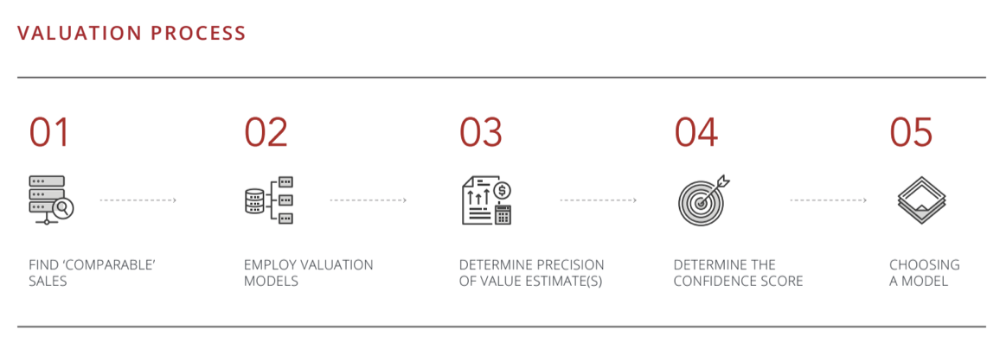
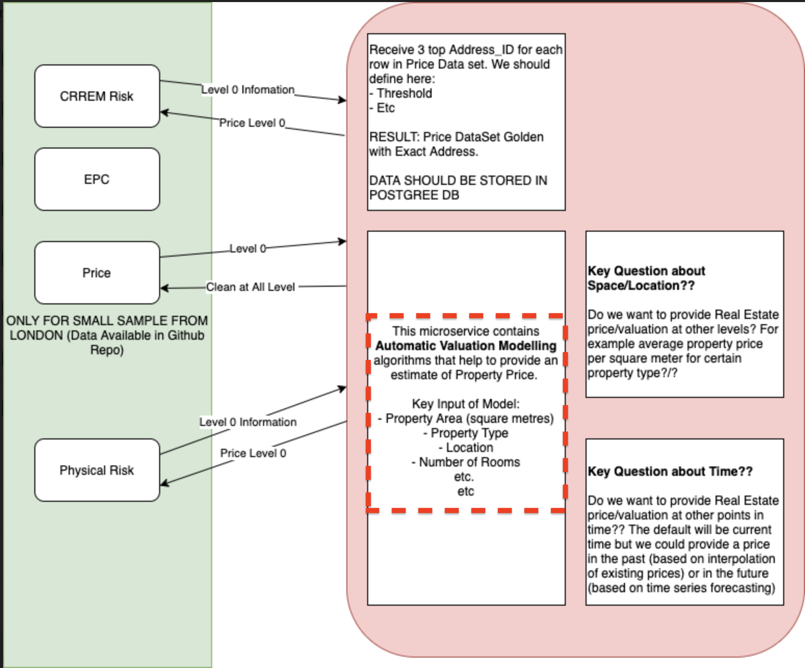

# Automated Valuation Model

#### Automated Valuation Model (AVM) is a term for a service that uses mathematical modeling combined with databases of existing properties and transactions to calculate real estate values. The majority of automated valuation models (AVMs) compare the values of similar properties at the same point in time. Many appraisers, and even Wall Street institutions, use this type of model to value residential properties. (see [What is an AVM](https://www.investopedia.com/terms/a/automated-valuation-model.asp) Investopedia.com)

#### Why do real estate business use AVMs?
- Real estate companies often use Real Estate AVMs to capture the contact information of potential home-sellers.  Home sellers are valuable leads in the real estate industry and the assumption is that people looking to learn the value of a home might want to sell that home.  Many solution providers sell versions of AVM (the most well-known example is the Zillow Zestimate).  Companies take those AVMs, put them on their website or page and try to identify people in their area who will likely enter the real estate market.

#### Popular Commercial AVM's
* [Zestimate](https://www.zillow.com/zestimate/) - The Zestimate® home valuation model is Zillow’s estimate of a home's market value. The Zestimate incorporates public and user-submitted data, taking into account home facts, location and market conditions.

* [Core Logic](https://www.corelogic.com/landing-pages/automated-valuation-models.aspx) -  CoreLogic® is the chosen AVM provider for 8 of the top 10 U.S. mortgage lenders. 

* [House Canary](https://www.housecanary.com/products/data-points/) - We compute instant valuations spanning property and land values, home equity, and more, and report on the data density behind our conclusions. Gain speed and reduce errors with values and context exactly when and where you need them most.

* [Attom Data](https://www.attomdata.com/data/analytics-derived-data/avm-property-valuations/) - Utilizing more than 80 million homes in our property database across all 50 states and representing 99% of the US population, and valuation software developed by Automated Valuation Model Analytics

### Valuation Process

### Interesting GitHub Repositories related to AVM's
* [Zillow-Kaggle](https://github.com/junjiedong/Zillow-Kaggle/blob/master/README.md) - This repo tackles the first round of Zillow’s Home Value Prediction Competition, which challenges competitors to predict the log error between Zestimate and the actual sale price of houses. And the submissions are evaluated based on Mean Absolute Error between the predicted log error and the actual log error. The competition was hosted from May 2017 to October 2017 on Kaggle, and the final private leaderboard was revealed after the evaluation period ended in January 2018.

* [AutomatedValuationModel](https://github.com/jayshah5696/AutomaticValuationModel/blob/master/notebooks/Final_notebook.ipynb) -  Automated valuation model (AVM) is the name given to a service that can provide real estate property valuations using mathematical modelling combined with a database. Most AVMs calculate a property’s value at a specific point in time by analyzing values of comparable properties. Some also take into account previous surveyor valuations, historica…

* [Lots more on Kaggle](https://www.kaggle.com/c/zillow-prize-1/notebooks) - The Zillow Prize contest competition, sponsored by Zillow, Inc. (“Sponsor”) is open to all individuals over the age of 18 at the time of entry. The competition will contain two rounds, one public and one private.. Each round will have separate datasets, submission deadlines and instructions on how to participate. The instructions on how to participate in each round are listed below. Capitalized terms used but not defined herein have the meanings assigned to them in the Zillow Prize competition Official Rules.

### Other interesting articles
* [towardsdatascience.com](https://towardsdatascience.com/automated-valuation-model-how-it-works-in-real-estate-industry-8d082757e1ed) - Automated Valuation Model — How It Works in Real Estate Industry?

### How does it relate to BCI Risk Modeling?

### Interesting cross-over companies using AVM technology in the context of climate risk modeling
* [Jupiter Intelligence](https://jupiterintel.com) - Predicting Risk in a Changing Climate: Jupiter’s AI and Scientific Models Deliver Unrivaled Power

### Development Plan
- EDA on golden dataset (due by July 1st) - volunteers? email mike.casale@blockchainclimate.org
- Basic machine learning studies of different models (due by July 8th) - volunteers? email mike.casale@blockchainclimate.org
- Hypertuning & final analysis of machine learning studies (due by July 8th) - volunteers? email mike.casale@blockchainclimate.org
- Completed AVM modeling and pipeline + integrate with AWS microservice (due by Aug 1st) - volunteers? email mike.casale@blockchainclimate.org